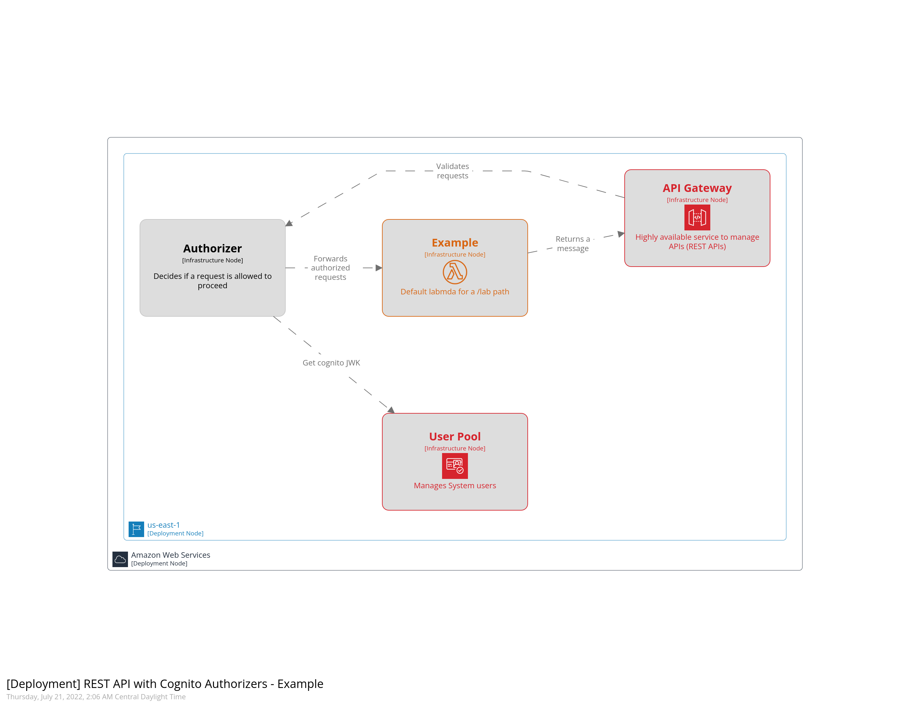

# Architecture Diagram
Simple example of using AWS API gateway with cognito authorizers to authenticate & authorize requestsm a JWT.

### Structurizr Diagram
To render this diagram, make sure to start the lite server (i.e. `task docs`), this won't be rendered on the README

### PNG Diagram

