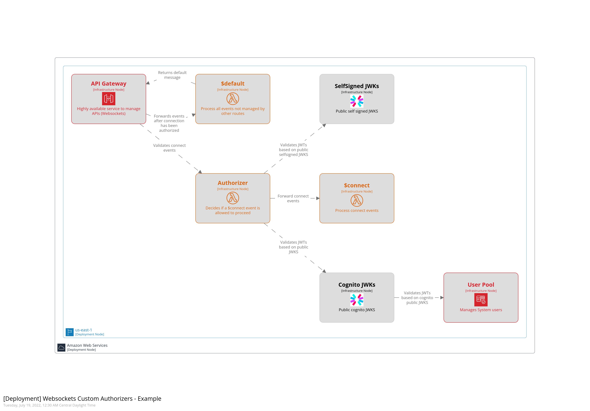

# Architecture Diagram
Simple example of using AWS API gateway v2 authorizers to authenticate & authorize requests signed by different JWKS, those being cognito and a self signed pair, also, the authorizer passes context to the backend by parsing the group claims from a JWT, decoupling authn & authz

### Structurizr Diagram
To render this diagram, make sure to start the lite server (i.e. `task docs`), this won't be rendered on the README

### PNG Diagram

