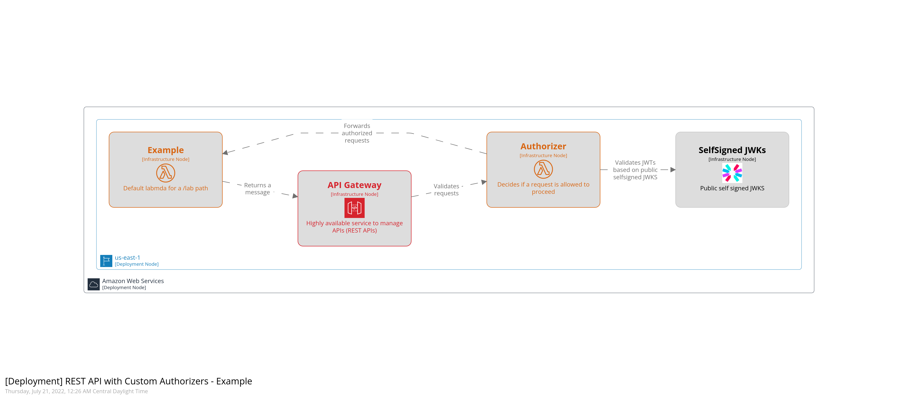

# Architecture Diagram
Simple example of using AWS API gateway (REST API) authorizers to authenticate & authorize requests signed by a self signed JWK, the authorizer passes the request context to the backend, decoupling authn & authz

### Structurizr Diagram
To render this diagram, make sure to start the lite server (i.e. `task docs`), this won't be rendered on the README

### PNG Diagram

